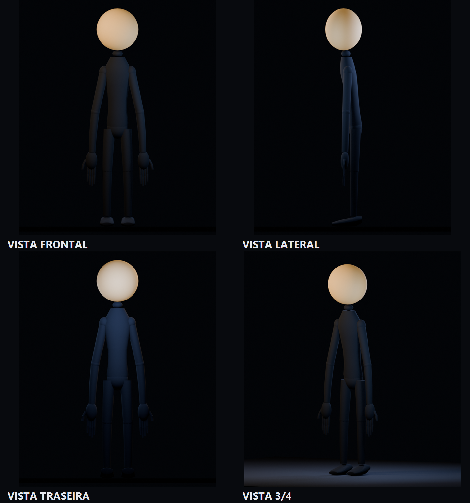
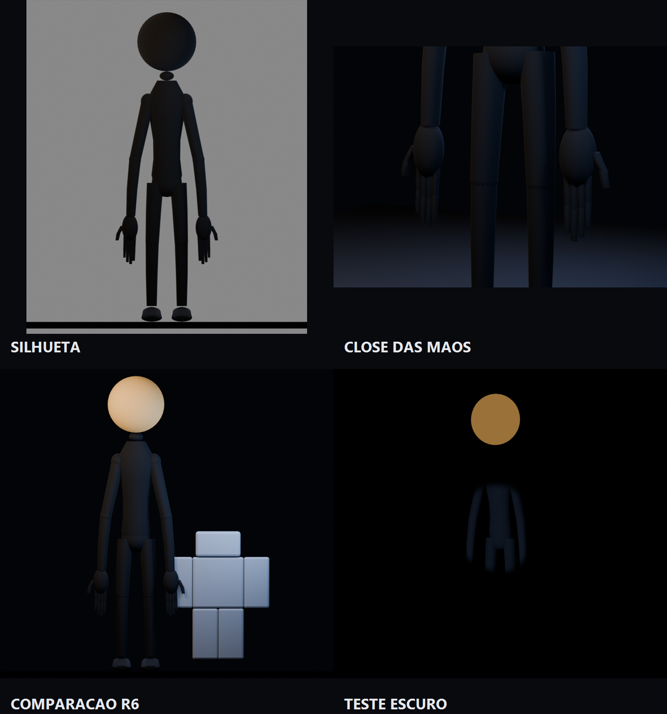

# Produção 3D

Arquivos-fonte, referências, relatórios e renders dos modelos 3D de **THE THIRD LIGHT**.

## Homem Lua

Local: [`moon_man/`](moon_man/)

- M1 — blockout e validação de silhueta: aprovada.
- M2 — refino do corpo, mãos, dedos e pés: concluída, aguardando aprovação.
- M3 — cabeça e rosto: não iniciada.

Arquivos editáveis:

- [`MoonMan_M1_Blockout.blend`](moon_man/source/MoonMan_M1_Blockout.blend)
- [`MoonMan_M2_Body.blend`](moon_man/source/MoonMan_M2_Body.blend)

Pranchas de validação da M2:

